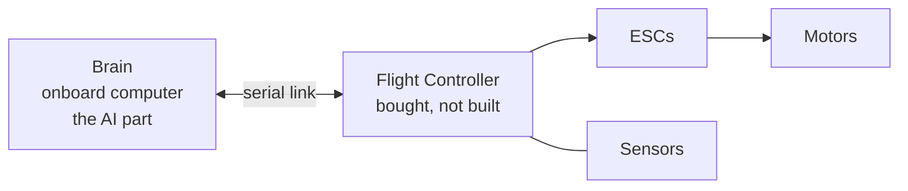

# Droni

An autonomous drone, built by **Hamza Ahmed ("Spoon")** and **Haider Ali (Satoru)** and **Hussain Sarhan (V1P3R)** as our final-year project.

Hamza is building the brain - the AI and autonomy software that flies the drone. Haider is building the body - picking, wiring, and assembling the physical drone. We're documenting the project and working on it every day, because that's the only way something like this actually gets finished well.

## What it does

*(edit this bit to say exactly what it does - a couple of sentences is enough)*

An onboard computer (`Brain/`) runs the autonomy side and talks to a flight controller - a bought board that handles the actual flying, like keeping the drone level and spinning the motors correctly. `Brain/` handles the smart part on top of that: [navigation / obstacle avoidance / following a target / whatever the actual mission is].



## How the hardware side works

We're not designing our own circuit boards or 3D-modeling our own parts - see `docs/hardware/2-architecture/adr/0001-off-the-shelf-hardware.md` for why. We buy proven parts and spend our time picking the right ones, wiring them correctly, and making sure the whole thing works reliably together. That's still real engineering - just a different kind than designing a board from scratch.

## Who's doing what

| | Working on | Docs |
|---|---|---|
| **Hamza Ahmed** - Spoon | `Brain/` - the AI / autonomy code | `docs/software/` |
| **Haider Ali** | `Body/` - picking parts, wiring, building | `docs/hardware/` |
| **Hussain Sarhan** | `Body/` - programming the body, building, documenting | `docs/hardware` |

## How the project is organized

```
Brain/    the autonomy code
Body/     parts list, wiring diagrams, flight-controller settings
docs/
  software/   the plan and the decisions behind Brain/
  hardware/   the plan and the decisions behind Body/
```

Both `docs/` folders follow the same simple order: figure out what's needed, then how the pieces fit together, then the details, then build and test. Each `methodology.md` explains it in plain words, and every file in the tree explains itself at the top - so if you're ever unsure what a file is for, just open it.

## Where things stand

Just getting started - see `docs/hardware/README.md` and `docs/software/README.md` for the checklist.

## A couple of ground rules

- Write things down the same day, not a week later - that's the whole point of documenting as we go.
- Whoever changes the connection between `Brain/` and the flight controller updates `docs/hardware/4-integration-design/hardware-software-interface.md` - that file is the one thing we both depend on.

---

Good luck to us.
